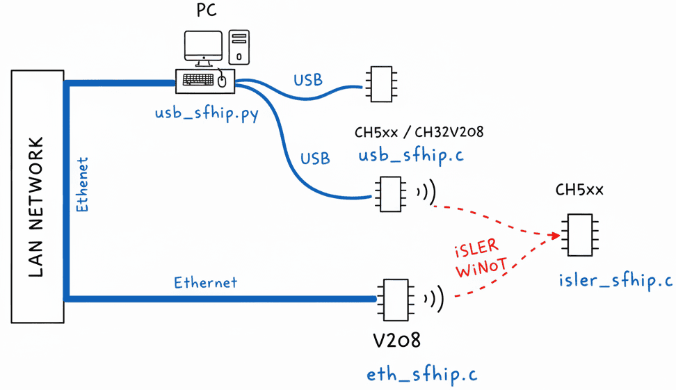

!!! WIP !!!

# ch32fun_WiNotAP
ch32fun iSLER WiNot AccessPoint, access points for WCH chips using Ethernet over RF

## iSLER WiNot protocol definition
!!! this is not the final protocol, but a tryout to get the tooling around it in a functional state !!!\
AP listens on channel 35 for communication requests from clients. All communication is initiated by the client using a request on the request channel.

### Request channel communication
1. All APs listen on the request channel on access address `0x63683332` (b'ch32')
2. Client pings the request channel with a PDU (see PDU section) + length byte + optional side channel (see Side channels sections) + one dummy (reserved) byte + its 32 bit uuid + payload (can be 0):
- c -> ap: `[PDU, len, side channel, dummy, uuid[0], uuid[1], uuid[2], uuid[3], payload[0], payload[1], ..., payload[len-6]]`
- If len=6 (8 byte header but PDU + len don't count) client has no data to send, but wants to know if AP has data for it.
3. AP responds within 3 ms on access address equal to client uuid, with a PDU (see PDU section) + length byte + new comm channel + one dummy (reserved) byte + its own uuid + payload (can be 0).
- ap -> c: `[PDU, len, new channel, dummy, uuid[0], uuid[1], uuid[2], uuid[3], payload[0], payload[1], ..., payload[len-6]]`
- If new channel is 35 (request channel), there is no new data for this client beyond what is in the response.
- If new channel is lower than 35, payload is zero and communication will continue on the new channel.
4. Either AP or client only sends data in the payload if everything fits in the single response frame.
If there is more data than fits in a single request, the payload in the request channel is zero, but the PDU indicates fragmentation (0x08).
5. The length byte is a bit odd, because of hardware constraints. It's the full length of the sent buffer -2, because the hardware does not count the PDU and len bytes.

### Data channel communication
1. Data channel communication is on access address equal to the client uuid.
2. Client confirms reception of AP channel allocation within 3 ms on the data channel, by sending a PDU (see PDU section), length byte + two dummy (reserved) bytes + payload (can be 0).
- c -> ap: `[PDU, len, dummy1, dummy2, payload[0], payload[1], ..., payload[len-2]]`
3. AP and client exchange messages by listening on the data channel, and switching to transmit mode whenever they have data to send
- [ap,c] -> [c,ap]: `[PDU, len, dummy1, dummy2, payload[0], payload[1], ..., payload[len-2]]`
4. The channel remains open for 20 ms for fast path interaction, after that a new data channel has to be requested by the client.
5. The last fragment will have a fragment index set and the fragment indicator byte (bit 3) not set, indicating end of frame.
The receiver (either client or AP) will acknowledge which fragments it received in it's next transmission by either sending it's own response data as acknowledgement,
or by sending a retransmission request with all 4 LSB bits in the PDU set (0xf, b1111), a length byte, and a payload with n bytes for n missing fragments indicating the missing fragments:
- [ap,c] -> [c,ap]: `[PDU(0x0f), len(n missing fragments), missing_fragment_idx1, missing_fragment_idx2, ...]`

### PDU and data fragmentation
`iSLERRX(...)` and `TX(...)` specify a PDU byte, originally intended for BLE frame type. In WiNot this is used to indicate a fragmented ethernet frame.
If bit 3 (0x08, b1000) of the PDU is set, it's part of a fragmented frame, with bits 0,1 and 2 indicating which part of the frame the current fragment is (fragment index).

### Side channels
Clients often just want to send a little bit of data, for example the readout of a temperature sensor or switch. To enable such reports over for example MQTT or ntfy.sh
the third byte in the client request can be set, and the Access Point will handle the delivery according to the side channel number so the TCP handshake does not
need to go over WiNot. Two example side channels are implemented in the USB AP, in `usb_sfhip.py`, which differ only by their sidechannel number:
- c -> ap: `[PDU(0x00), len, side channel(0x01(MQTT) or 0x02(ntfy.sh)), dummy, uuid[0], uuid[1], uuid[2], uuid[3], payload[0], payload[1], ..., payload[len-6]]`
- `payload[]` for both MQTT and ntfy.sh is of the following form: `ip[0], ip[1], ip[2], ip[3], topic[0], topic[1], ..., topic[tlen-1], '/', payload[0], payload[1], ..., payload[len-6 -4 -tlen -1]`
Further side channels can be implemented easily by extending the `def process_sidechannel(channel, data)` funtion in `usb_sfhip.py` and sending the specific sidechannel number in the client request.

## TODO
- [x] iSLER: fix ch573
- [x] add side channels for ntfy.sh and MQTT
- [ ] fix v208 ETH AP
- [ ] iSLER: fix S2 and S8
- [ ] improve timing
- [ ] remove debug putchars
- [ ] test with multiple clients / APs
